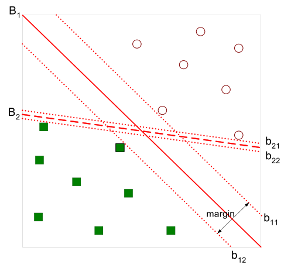

为了简便，我们从二分类问题开始。

## 损失函数

<!-- more -->

为了将绿色方块的点和红色圆圈的点分开，我们需要找到超平面（在二维空间中是线，三维是平面）。在上图中，直觉告诉我们，$B_1$的线更加好，因为它对训练样本局部扰动的“容忍”性最好。

我们可以用以下的线性方程组描述$B_1$：
$$
\textbf{w}^T\textbf{x} + b = 0
$$
其中$\textbf{w}$就是该超平面的法向量，关于这点，我们可以任取在该超平面上的两个点$x_1, x_2$，减一下得到$\textbf{w}^T(x_1 - x_2) = 0$，那么对于$x_1, x_2$所决定的直线，$w$都与它垂直，所以它就是法向量。

那么任意点到超平面的距离也就可以写成：
$$
r = \frac{|\textbf{w}^T\textbf{x} + b|}{||\textbf{w}||}
$$
关于这点，我们可以这么想，任取$B_1​$上任意一点$\textbf{x'}​$（过渡的中间变量），那么对于任意一点$\textbf{x}​$到超平面的距离为$x-x'​$在法向量$w​$上的投影长度：
$$
r = \frac{|\textbf{w}^T(\textbf{x} -\textbf{x'})|}{||\textbf{w}||} = \frac{|\textbf{w}^T\textbf{x} + b|}{||\textbf{w}||}
$$
那么对于一个分类器$y= \textbf{w}^T\textbf{x} + b$，对一个样本$x_i$我们可以令：

$$
\left\{
\begin{aligned}
\textbf{w}^T\textbf{x} + b \ge +1, y_i = +1 \\
\textbf{w}^T\textbf{x} + b \le -1, y_i = -1
\end{aligned}
\right.
$$
我们可以通过成倍的改变$w, b​$来改变不等式右边的值，这里固定为1便于后面计算。

那几个让等号成立的点被称为支持向量，也就是图中的$b_{11}$和$b_{12}$，

那么：

$$
margin \ \gamma = \frac{2}{||\textbf{w}||}
$$
svm就是想要找到最大margin的超平面，现在我们可以用数学语言来描述这个需求：
$$
\max \limits_{w, b}\frac{2}{||\textbf{w}||} \\
s.t. y_i(\textbf{w}^T\textbf{x} + b) \ge 1, i=1,2,...,m.
$$
$y_i​$用于消除正负的影响。

上面的式子又等价于（为了简便）：
$$
\min \limits_{w, b}\frac{1}{2}{||\textbf{w}||}^2 \\
s.t. y_i(\textbf{w}^T\textbf{x} + b) \ge 1, i=1,2,...,m.
$$
现在，我们有了SVM的数学描述，下面就是如何求解了。

## 拉格朗日乘子法

其实这就是一个凸二次优化问题，有现成的库可以直接求解，但是我们还有更优雅的数学上的解法。

”拉格朗日乘子法是一种经典的求解条件极值的解析方法，可将所有约束的优化模型问题转化为无约束极值问题的求解。“我们使用拉格朗日乘子法将上述问题转化为它的”对偶问题“，便于解决。

我们首先添加拉格朗日乘子$\alpha_i \ge 0$，从而得到：

$$
L(w, b, \alpha) = \frac{1}{2}{||\textbf{w}||}^2 + \sum \limits_{i=1}^m\alpha_i(1-y_i(w^Tx_i+b))
$$
令

$$
\theta(w) = \max_{\alpha_i\geq 0}\mathcal{L}(w,b,\alpha)
$$
当所有的$y_i(\textbf{w}^T\textbf{x} + b) \ge 1$时，$\theta(w) $显然取到最大值$\frac{1}{2}{||\textbf{w}||}^2$，否则$\theta(w) $能够取到$\infty$。所以当满足所有约束条件时，最小化$\theta(w)$就是最小化$\frac{1}{2}{||\textbf{w}||}^2$。

也就是：
$$
\min_{w,b}\;\theta(w) = \min_{w,b}\; \max_{\alpha_i\geq 0}\; \mathcal{L}(w,b,\alpha) = p^*
$$
这里我们是先对$\alpha$求最大值，之后再对$w, b$求最小值。

下面我们先对$w, b​$求最小，再对$\alpha​$求最大。

即：
$$
\max_{\alpha_i\geq 0}\; \min_{w,b}\; \mathcal{L}(w,b,\alpha) = d^*
$$
因为最大值中的最小值肯定大于等于最小值中的最大值，所以$$p^* \ge d^*$$

当满足KKT条件时，$$p^* = d^*$$。

此处，kkt条件应为
$$
\alpha \ge 0 \\

 y_i(\textbf{w}^T\textbf{x} + b) - 1\ge 0 \\

 \alpha_i(y_i(w^Tx_i+b) - 1) = 0
$$
关于这点请参考https://www.zhihu.com/question/23311674。

简单的说，在极值点$x^*$，目标函数增大的方向应该被排除在外。

因为先对$w, b$求最小，那么先令w和b的偏导等于0：
$$
w = \sum \limits_{i=1}^m\alpha_iy_ix_i \\

\sum \limits_{i=1}^m\alpha_iy_i = 0
$$
将w和b代入原式：
$$
L(w,b,a) = \sum \limits_{i=1}^n\alpha_i- \frac{1}{2}\sum \limits_{i=1}^m\alpha_i\alpha_jy_iy_jx^T_ix_j
$$
经过如上的转化，我们把问题转化为了：
$$
\max \limits{a} \sum \limits{i=1}^n\alpha_i- \frac{1}{2}\sum \limits_{i=1}^m\alpha_i\alpha_jy_iy_jx^T_ix_j \\

s.t. a_i \ge 0, i=1, ..., n \\

\sum \limits_{i=1}^m\alpha_iy_i = 0
$$

## SMO

为了求出$\alpha$，我们会使用SMO算法。

针对$\sum \limits_{i=1}^m\alpha_iy_i = 0$此式，我们假设$\alpha_1和\alpha_2$是变量，其他的$\alpha$是常量。那么
$$
\alpha_2 = \frac{1}{y_2}\left(\sum_{i=3}^n\alpha_iy_i-\alpha_1y_1\right) \triangleq y_2\left(K-\alpha_1y_1\right)
$$
将$\alpha_2$带回原目标函数中，就可以消去$\alpha_2$，那么整个目标函数就是一个关于$\alpha_1$的一元二次函数。同时因为$\alpha_1和\alpha_2$都有范围，所以可以得到$\alpha_1$的一个取值范围，在这个范围内，我们可以很快的对二次函数求最大值，即完成一次迭代。

## 软间隔

我们之前讨论的默认条件是数据是线性可分的。我们在样本空间中找到一个超平面将其完全分割开来，这个超平面是最大化margin来确定的。但是很多情况下，数据不是线性可分的，会有一些outlier，如果我们将这些outlier也算进去，那我们获得的超平面会有很大程度上的过拟合。

我们原来对所有的样本都要求
$$
y_i(w^Tx_i+b)\geq 1
$$
现在我们允许一些样本不满足上述约束，当然，这样的样本应该尽量的少。

我们改写原来的优化目标：
$$
\min \limits_{w, b}\frac{1}{2}{||\textbf{w}||}^2 + C\sum \limits_{i=1}^m l_{0/1}(y_i(w^Tx_i+b) - 1), C > 0
$$
这里的$C$用来控制第一项寻找margin最大的超平面和第二项保证数据量偏差最小之间的权重。上式中的$$l_{01}$$ 是一个01损失函数，我们一般使用hinge loss来替换它：
$$
l_{hinge}(z) = max(0, 1-z)
$$

原本的分类平面是红色的线，对应的分别是蓝色和粉色的线。但是考虑到黑圈圈起来的蓝点，原来的超平面就偏移到黑色虚线那里了。

现在我们引入松弛变量$\xi_i\geq 0$ ，对应上图黑色线段，据此将约束条件改为
$$
y_i(w^Tx_i+b)\geq 1 - \xi_i
$$
再重写上式
$$
\min \limits_{w, b}\frac{1}{2}{||\textbf{w}||}^2 + C\sum \limits_{i=1}^m \xi_i
$$
接下来同上面的拉格朗日乘子法，我们可以解得
$$
\begin{align} 
\max_\alpha &\sum_{i=1}^m\alpha_i – \frac{1}{2}\sum_{i,j=1}^m\alpha_i\alpha_jy_iy_j\langle x_i,x_j\rangle \\ 
s.t., &0\leq \alpha_i\leq C, i=1,\ldots,m \\ 
&\sum_{i=1}^m\alpha_iy_i = 0 
\end{align}
$$

### Reference

https://www.cnblogs.com/en-heng/p/5965438.html

《机器学习》 周志华

http://blog.pluskid.org/（kid神真的写的好啊）

https://www.cnblogs.com/90zeng/p/Lagrange_duality.html

https://www.cnblogs.com/jerrylead/archive/2011/03/18/1988419.html(SMO，写的非常详细)